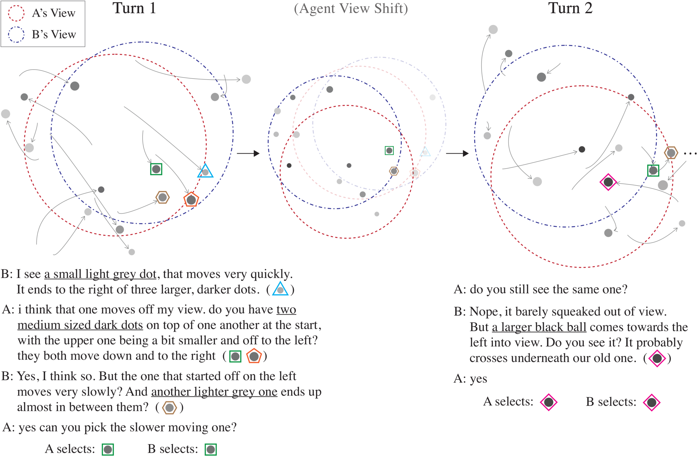

# Dynamic-OneCommon

This is the repository for our paper [Maintaining Common Ground in Dynamic Environments](https://arxiv.org/abs/2105.14207) (Udagawa and Aizawa, TACL 2021).

<p align="center">
  
</p>

<p align="center">
  
</p>

# Setup

Install and activate [pyenv](https://github.com/pyenv/pyenv).

```
pyenv install 3.7.7
pyenv local 3.7.7
```

Install and activate [poetry](https://github.com/python-poetry/poetry).

```
poetry install
poetry shell
```

You also need to unzip and place the pregenerated scenarios (environments) used in our dataset: please refer to the [scenarios](https://github.com/Alab-NII/dynamic-onecommon/tree/master/scenarios) directory for details.

# Scenarios

To generate new scenarios (environments) for Dynamic-OneCommon, you can use the [scenarios](https://github.com/Alab-NII/dynamic-onecommon/tree/master/scenarios) directory.

# Web Application

To collect and review human dialogues (e.g. from Amazon Mechanical Turk), you can use the [webapp](https://github.com/Alab-NII/dynamic-onecommon/tree/master/webapp) directory.

# Dataset Analysis

To analyze the collected dataset, you can use the [data](https://github.com/Alab-NII/dynamic-onecommon/tree/master/data) directory.

# Experiments

To train and evaluate baseline dialogue models, you can use the [experiments](https://github.com/Alab-NII/dynamic-onecommon/tree/master/experiments) directory.
